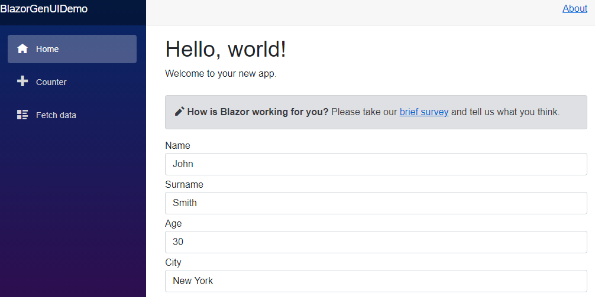

# BlazorGenUI

This is BlazorGenUI framework. Providing automatic generation of simple UI from C# objects based on BootStrap. Supporting both server-side and webassembly Blazor.

## Why this project

I'm really excited about Blazor technology. Some time ago I stumble upon idea to use it for automatic generation of UI. This experiment became idea for my bachelor thesis and as now I'm really satisfied with results. Therefore I've decided to share it open source to gather some community feedback.

Framework provides Blazor component for dynamic UI generation. It requires context in the form of instantiated object and is able to generate corresponding UI.

This can be used to create scalable UI interfaces with often changing models. You are able to generate UI from encapsulated DTO's (data transfer objects) acquired from API quick and with low effort. You can customize UI with supported layouts and styles. Customization is possible in code with component's parameters or within objects with data annotations. See **features**.

**This is still experimental so bugs may occur!**

## Getting Started

**See [demo application](https://specter-13.github.io/) for examples.**

### Prerequisites
Blazor WebAssembly or Blazor Server project based on .NET5.
### Installing
After you have created your Blazor project, you need to do the following steps:

**Install latest NuGet package BlazorGenUI.**

BlazorGenUI NuGet: link


In *index.html* or *_Host.cshtml* based on your Blazor application type add reference to bootstrap. Replace Blazor built-in bootstrap with following line:

```
<link href="_content/BlazorGenUI/bootstrap-generic.min.css" rel="stylesheet"  />
```

Add the following lines to your _Imports.razor file:
```
@using BlazorGenUI.Components.Renderable
@using BlazorGenUI.Reflection.Enums
@using BlazorGenUI.Reflection.Models
```
Register BlazorGenUI services in DI container of your application. 

If you using Blazor Server add following line to your *ConfigureServices* method located in *Startup.cs*:

```
services.AddBlazorGenUIServices();
```
If you using Blazor WebAssembly add following line to your *Main* method located in *Program.cs*:
```
builder.Services.AddBlazorGenUIServices();
```

## How to use

Create your object. You can whether acquired it from API or create in app. For this example let's consider following class Person:

```
public class Person
{
    public string Name { get; set;}
    public string Surname { get; set;}
    public int Age { get; set;}
    public string City { get; set;}
}
```

In your Razor file instantiate Person object and use it as context to renderer. 
```
@if (TestPerson != null)
{
    <RenderableContentControl Context="TestPerson" 
                              Presentation="PresentationType.Control"/>
}

protected override void OnInitialized()
{
    TestPerson = new Person
    {
        Name = "John",
        Surname = "Smith",
        Age = 30,
        City= "New York"

    };
}
```
You will get following automatic generated UI:


See **features** more customizable options.
# Contributing
Feel free to create issues and pull requests.

# License
This project is licensed under the MIT License - see the LICENSE file for details

